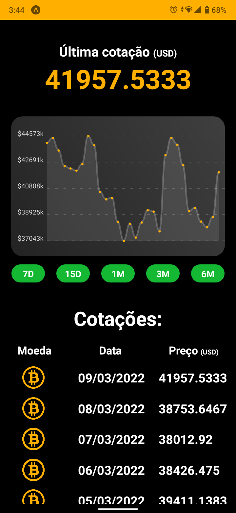

# BitQuotation

# Sobre
O BitQuotation é o app ideal para acompanhar o preço de mercado do Bitcoin. Fazendo uma consulta à API pública da Coindesk, representando em um gráfico de linhas feito a partir da lib react-native-chart-kit e listando os dados num componente FlatList, você tem o necessário para se manter atualizado com suas ações.

